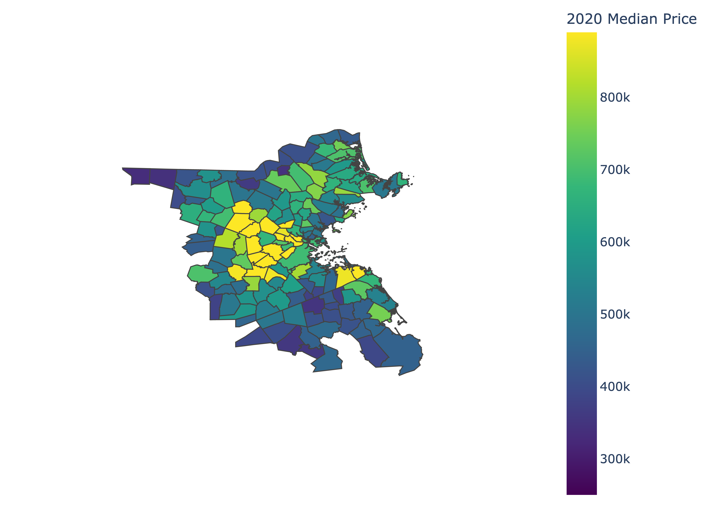

# boston-housing

## Metro Boston housing data analysis.   

Description:
Metro Boston housing prices and days on market for the period 2013-2021. Explore recent pricing trends (2019-2021) in an interactive [Streamlit App](https://share.streamlit.io/nchowes/boston-housing/main), and interactive maps for the period 2010-2020 via the links below. 
 
&nbsp;

### Metro Boston Housing Interactive Maps 

[2020 Boston Housing Prices](https://cold-agate-invert.s3.amazonaws.com/boston-housing/2020-boston-housing-median.html)  
[2010 Boston Housing Prices](https://cold-agate-invert.s3.amazonaws.com/boston-housing/2010-boston-housing-median.html)  
[Ten Year Price Change (2010-2020)](https://cold-agate-invert.s3.amazonaws.com/boston-housing/boston-housing-10yc-2010-2020.html)  
[One Year Price Change (2019-2020)](https://cold-agate-invert.s3.amazonaws.com/boston-housing/boston-housing-1yc-2019-2020.html)  

Please see images below for thumbnail preview of the interactive links.  

&nbsp;

#### 2020 Boston Housing Prices

&nbsp;

#### Ten Year Price Change (2010-2020)

&nbsp;

#### One Year Price Change (2019-2020)

&nbsp;

## Getting started w/ the codes 

See: 
+ boston-housing-etl-clean: data acquisition and preparation 
+ boston-housing-geospatial: generate choropleth maps
+ streamlit_app: deployment to streamlit
+ housinganalysis.py: project utilities